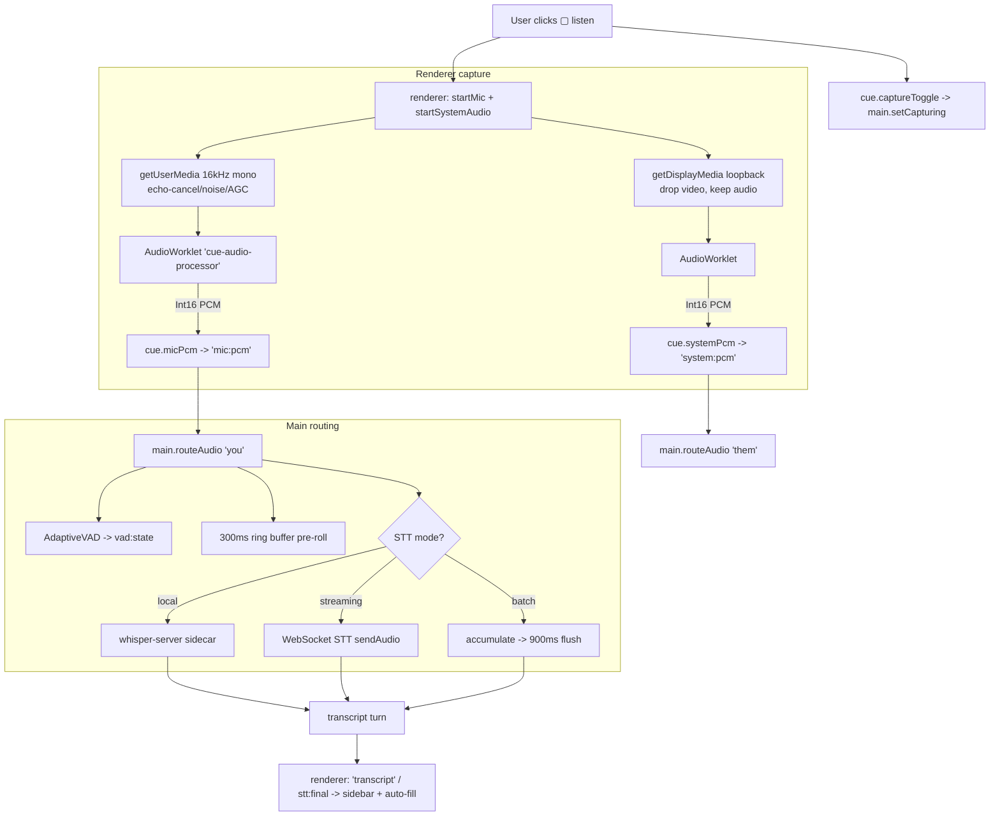
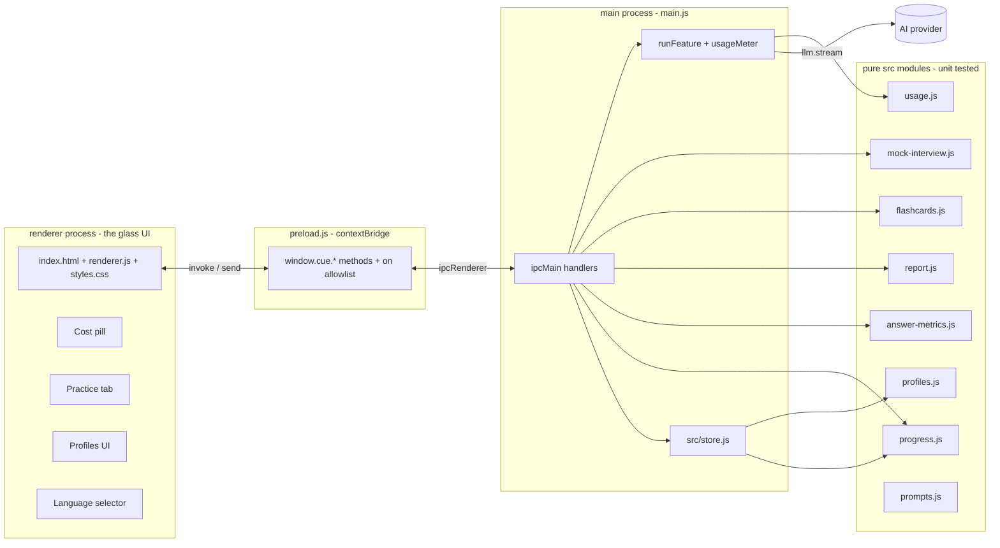
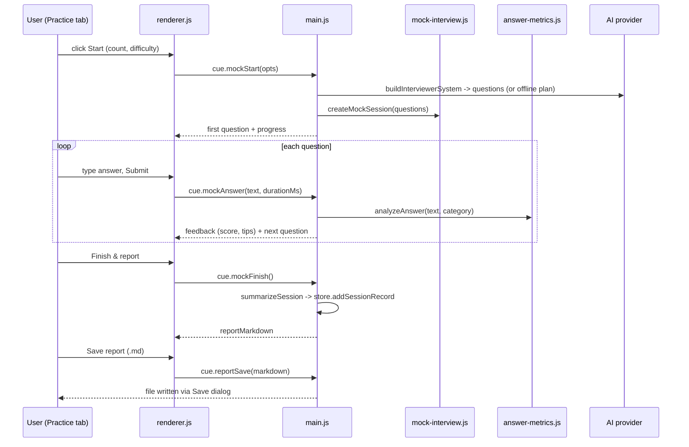

# cue — Interview-Practice Enhancements: Architecture & Deep Dive

This document explains, in depth, the enhancement layer added on top of the
open-source **cue** overlay: **what** we built, **why**, **how it works**, and
**how it was engineered and tested**. It is written to be readable by a new
contributor with no prior context.

---

## 1. Executive summary

cue is an Electron desktop "glass" overlay that takes three live inputs — your
**screen**, your **microphone**, and your **meeting audio** — and streams
answers from an AI model of your choice (bring-your-own-key).

We extended it from a live-assist tool into an **honest interview-practice and
coaching product**, and we removed a covert process-masquerade that impersonated
a Microsoft system binary.

The work was delivered as **eight small, pure, unit-tested JavaScript modules**
under `src/`, wired into the app through the existing **Electron main ⇄ preload ⇄
renderer** IPC boundary, and surfaced through the existing settings UI plus one
new **Practice** tab.

| Metric | Before | After |
| --- | --- | --- |
| Test count | 130 passing | **197 passing** (+67) |
| New `src/` modules | — | 7 (+ `prompts.js` changes) |
| New test files | — | 8 |
| Covert process masquerade | present | **removed** |

---

## 2. Background: what cue already did

- **Overlay** — a frameless, transparent, always-on-top window rendered by the
  renderer process. It is content-protected (hidden from screen shares) via
  `setContentProtection(true)` (`WDA_EXCLUDEFROMCAPTURE` on Windows /
  `NSWindowSharingNone` on macOS).
- **Three inputs** — screen (`desktopCapturer`), your mic (`getUserMedia`), and
  meeting audio (`getDisplayMedia` loopback), transcribed by a selectable STT
  provider (local whisper.cpp, OpenAI, Gemini, Deepgram).
- **Provider abstraction** — `src/llm.js` exposes one streaming interface
  (`stream({ system, turns, imageDataUrl, maxTokens, onToken })`) over OpenAI,
  Anthropic, Gemini, Azure, Groq, MiniMax, Ollama, and any OpenAI-compatible
  endpoint.
- **Modes** — `assist`, `say`, `followup`, `recap`, `ask`, `answerThis`,
  `leetcode`, each with a category-aware system prompt in `src/prompts.js`.

Our enhancements reuse all of the above rather than replacing any of it.

---

## 2A. The complete application working — startup to shutdown

This section traces the **entire runtime**, end to end, so you can follow a single
launch from process start to quit. cue is an Electron app, so everything below
happens across **two processes**:

- **Main process** (`main.js`) — Node.js with full OS access: windows, global
  shortcuts, screenshots, audio routing, STT, LLM calls, settings file.
- **Renderer process** (`renderer/`) — a sandboxed Chromium page (the glass UI):
  DOM, microphone/loopback capture, and word-by-word answer rendering.

They talk **only** through `preload.js`, which uses `contextBridge` to expose a
small, allow-listed `window.cue.*` API. The renderer has `nodeIntegration:false`
and `contextIsolation:true`, so it can never touch Node or a `src/` module
directly.

### A.1 Cold start & lifecycle

```mermaid
sequenceDiagram
  participant OS
  participant Main as main.js
  participant Perm as permissions.html
  participant Win as Overlay window
  participant Rend as renderer.js

  OS->>Main: launch (electron .)
  Note over Main: (macOS only) append Chromium switches<br/>for system-audio loopback
  Main->>Main: app.whenReady()
  Main->>Main: app.setName('cue'); process.title='cue'
  alt macOS and permissions missing
    Main->>Perm: createPermissionsWindow() (gate)
    Perm-->>Main: permissions:continue
  end
  Main->>Main: launchApp() — start AppLink + Whisper mgr
  Main->>Win: createWindow() (frameless, transparent, always-on-top)
  Win->>Win: setContentProtection(true) — hide from capture
  Win->>Rend: loadFile(index.html)
  Rend->>Main: cue.settingsGet()
  Main-->>Rend: settings (cue-data.json merged with defaults)
  Rend->>Rend: fillSettings(), wire buttons, render tutorial
  Main->>Main: registerShortcuts()
```

**Key startup facts (from `main.js`):**
- On macOS, before `app.whenReady`, Chromium switches
  (`MacLoopbackAudioForScreenShare`, `MacSckSystemAudioLoopbackOverride`) are
  enabled so `getDisplayMedia` can capture system audio.
- The app names itself **`cue`** (the Microsoft-process masquerade was removed).
- The Whisper model manager and the **AppLink** named-pipe server are started in
  `launchApp()`.

### A.2 Permissions gate

- **macOS** needs two grants — **Microphone** and **Screen Recording**. On first
  launch a dedicated `permissions.html` window blocks until both are granted
  (`permissions:check` / `permissions:request` / `permissions:continue`).
  Screen access is verified robustly: `getMediaAccessStatus('screen')` is
  unreliable, so cue also attempts a real capture and inspects the thumbnail for
  non-zero pixels.
- **Windows** needs only the **microphone**; screenshots and loopback audio need
  no grant.

### A.3 The overlay window

`createWindow()` builds a `BrowserWindow` that is `frame:false`,
`transparent:true`, `alwaysOnTop:true`, `skipTaskbar:true`, `resizable:true`,
positioned from saved `windowX/windowY` (clamped to the work area). Then:

- **Invisibility** — `setContentProtection(true)` maps to
  `WDA_EXCLUDEFROMCAPTURE` (Windows 19041+) / `NSWindowSharingNone` (macOS).
  `CUE_NO_PROTECT=1` disables it for debugging.
- **Out of the way** — on Windows `type:'toolbar'` removes it from Alt-Tab and
  the taskbar; `setAlwaysOnTop(true,'screen-saver')` and
  `setVisibleOnAllWorkspaces` keep it above full-screen apps.
- **Click-through** — the renderer marks empty regions click-through via
  `setIgnoreMouseEvents` (`mouse:ignore`), so gaps around the panel never block
  the app behind it.
- Window moves are debounced and persisted to `cue-data.json`.

### A.4 Global shortcuts (`registerShortcuts`)

| Shortcut (Win / mac) | Action |
| --- | --- |
| `Ctrl/⌘ + Enter` | `assist` — do the smart thing |
| `Ctrl/⌘ + Shift + Enter` | `say` — what to say next |
| `Ctrl/⌘ + H` | `leetcode` — solve on-screen coding problem |
| `Ctrl/⌘ + Shift + /` | hide / collapse the panel |
| `Ctrl/⌘ + Shift + X` | quit |

Registration return values are tracked in `shortcutState` so cue can report a
shortcut another app has already claimed.

### A.5 Listening — the audio capture pipeline

This is the heart of the app. Toggling the **▢** button starts capture. Audio is
captured **in the renderer** (so it uses cue's own permission grant) and routed
to the main process as raw 16 kHz mono PCM.



**Three STT modes** (`setCapturing` picks one):

1. **Local** (`sttProvider:'local'`) — `startLocalWhisper` boots a persistent
   `whisper-server` sidecar on `127.0.0.1`; audio never leaves the machine and is
   never written to disk. VAD segments utterances; both channels share one
   serialized inference queue.
2. **Streaming** — `initStreamingSTT` opens a WebSocket per channel
   (Deepgram / OpenAI Realtime); `onInterim` emits `stt:interim` (live partial
   text), `onTranscript` emits `stt:final`.
3. **Batch** (fallback) — `startFlushLoop` runs every **900 ms**; `flushChannel`
   concatenates buffered PCM, discards anything under ~0.12 s or below the RMS
   silence gate, calls `createSTT(settings).transcribe(pcm)`, and publishes the
   text.

Every finalized utterance becomes a `{ channel:'you'|'them', text, ts }` turn,
pushed into the `transcript[]` array (capped at 200 turns ≈ 30–40 min) and sent
to the renderer, which shows it in the history sidebar and can auto-fill the
input box. The **"You"** channel is your mic; the **"Them"** channel is the
meeting audio — keeping them separate is what powers *"What should I say?"*.

> Platform note: `getDisplayMedia` loopback returns an audio track on Windows out
> of the box; on macOS it needs 14.4+ (ScreenCaptureKit), otherwise the "Them"
> channel is silent while screen + mic keep working.

### A.6 Answering — from trigger to streamed reply

Any of three triggers — a global shortcut, an action button (`data-mode`), or a
typed question — calls `cue.ask({ mode, text })`, which sends the `ask` IPC to
`runFeature(mode, userText)` in main:

```mermaid
sequenceDiagram
  participant Rend as renderer
  participant Main as runFeature
  participant Ctx as interview-context.js
  participant P as prompts.js
  participant Cap as screen.js
  participant LLM as provider
  participant U as usage.js

  Rend->>Main: cue.ask({mode,text})
  Main->>Main: guard state.busy; createLLM(settings)
  Main->>Rend: llm:start {userBubble, small, category}
  opt mode needs the screen
    Main->>Cap: captureScreenshot() -> PNG data URL
  end
  Main->>Ctx: buildInterviewContext(settings, mode, transcript)
  Main->>P: def.buildSystem(context, aiRules, responseLanguage)
  Main->>P: def.build({transcript, userText, lastSolution})
  Main->>LLM: llm.stream({system, turns, imageDataUrl, onToken})
  loop each token
    LLM-->>Main: token
    Main->>Rend: llm:token {text}
    Rend->>Rend: appendToken (markdown, word fade-in)
  end
  Main->>U: usageMeter.record(...) ; emit usage:update
  Main->>Rend: llm:done
  Rend->>Rend: finalizeAi()
```

**Details:**
- A **watchdog** (`STREAM_INACTIVITY_MS` = 25 s) aborts a stalled stream so
  `state.busy` can't wedge the app.
- For `leetcode` / `codeFollowup`, the full response is stored in
  `lastLeetcodeSolution` so a follow-up can refine the previous code.
- After completion, the **cost meter** records the request and emits
  `usage:update` (see §6.1).

### A.7 Screenshot capture (`src/screen.js`)

`captureScreenshot()` uses `desktopCapturer.getSources({ types:['screen'] })` at
full resolution (scaled by `scaleFactor`), prefers the primary display, and
returns a `data:image/png;base64,…` URL. It is only invoked for modes whose
definition sets `needsScreen:true` (`assist`, `ask`, `leetcode`, `codeFollowup`),
and the URL is passed to the model as `imageDataUrl` for vision.

### A.8 Context building (`src/interview-context.js`)

`detectCategory(transcript)` inspects the **last five "Them" turns** and matches
them against regex banks to classify the moment as `behavioral`, `motivation`,
`situational`, `experience`, `compensation`, `technical`, or `general`.
`buildInterviewContext` then injects **only the relevant** prep fields (résumé
sized by category, JD, STAR stories, salary target, etc.), keeping the prompt
tight. `leetcode` gets no personal context at all.

### A.9 Settings & persistence (`src/store.js`)

Settings live in a single JSON file, `cue-data.json`, under Electron's
`userData` directory — no native modules, so `npm install` stays clean.
`getSettings()` deep-merges the file over defaults; `setSettings(patch)` merges
and saves. Our additions (`responseLanguage`, `profiles`, `activeProfile`,
`sessionHistory`) live here too; profiles and history replace their slice
wholesale so deletions actually persist.

### A.10 AppLink (the "Iris" bridge)

cue runs a local **named-pipe** server (`src/applink.js`) that lets a companion
tool ask "what is cue doing?" Every caller must pass a **consent gate**
(`applink:consent-request` / `applink:consent-response`), consent is remembered
per caller, and it can be revoked in Settings. No network is involved.

### A.11 Shutdown

Stopping capture ends new audio immediately, drains the current STT queue for a
bounded time, and terminates the Whisper sidecar. `Ctrl/⌘+Shift+X` (or
`app:quit`) exits. There is deliberately no dock/taskbar icon, so the shortcut is
the primary quit path.

---

## 3. What we built (feature catalog)

| # | Feature | What it does | Core module |
| --- | --- | --- | --- |
| 1 | **Token / cost meter** | Live per-session estimate of tokens and USD cost of your own key usage | `src/usage.js` |
| 2 | **Answer scoring** | Scores a spoken/typed answer 0–100 on STAR structure, specificity, fluency, pace, length | `src/answer-metrics.js` |
| 3 | **Session report** | Exports a Markdown review (summary, per-question breakdown, focus areas, transcript) | `src/report.js` |
| 4 | **Multi-language** | Replies in English (default), a named language, or auto-matches the speaker | `src/prompts.js` |
| 5 | **Mock interview** | cue plays the interviewer, asks questions one at a time, scores each answer | `src/mock-interview.js` |
| 6 | **Settings profiles** | Save/load/delete a résumé + JD + prep set per company (never stores API keys) | `src/profiles.js` |
| 7 | **Flashcards** | Generates Q&A practice cards from your résumé + JD (with an offline fallback) | `src/flashcards.js` |
| 8 | **Progress tracking** | Records each session and computes improvement trends over time | `src/progress.js` |
| 9 | **Coding follow-ups** | After a coding solution: "optimize this", "explain line 12", "dry-run with X" | `src/prompts.js` (`codeFollowup`) |
| 10 | **Light/dark theme** | Follows the OS colour scheme; identical font in both | `renderer/styles.css` |
| 11 | **Security fix** | Removed the `MicrosoftEdgeUpdate.exe` process/icon masquerade | scripts + `main.js` |

---

## 4. Design principles (methodology)

Every feature followed the same discipline, which mirrors the existing codebase:

1. **Pure logic first.** All business logic lives in a `src/*.js` module that
   has **no `electron`, no network, and no filesystem dependency**. This makes it
   directly unit-testable with Node's built-in test runner and reusable from
   either process.
2. **Test before wiring.** Each module shipped with its own
   `test/*.test.js` file. We kept the suite green (`node --test test/*.test.js`)
   after every change — the baseline of 130 tests never regressed.
3. **Thin edges.** The Electron main process only *orchestrates* (reads
   settings, calls the pure module, streams the LLM). The `preload.js` bridge
   only *exposes* IPC. The renderer only *renders*.
4. **No behaviour change by default.** e.g. `responseLanguage` defaults to
   `English`, so existing users see identical output; coding modes stay strict.
5. **Offline-capable.** Mock interview and flashcards fall back to a built-in
   question bank and fully local scoring when no API key is configured.

---

## 5. Architecture overview



**The golden rule:** the renderer can never `require()` a `src/` module directly
(context isolation). Everything crosses the boundary through a named IPC channel
declared in `preload.js`.

---

## 6. Module-by-module deep dive

### 6.1 `src/usage.js` — token & cost meter

- **Why:** cue is bring-your-own-key, so users want to see what a session costs.
- **How:** streamed responses don't return exact token counts, so we use a
  transparent heuristic — `estimateTokens(text)` ≈ `ceil(length / 4)` — plus a
  `PRICES` table (USD per 1M tokens, input/output) for common models.
- **Key exports:** `estimateTokens`, `priceFor` (case-insensitive), `costOf`
  (returns `{ costUsd, priced }`), `createUsageMeter()` (session accumulator with
  `record` / `snapshot` / `reset`), `formatCost`.
- **Honesty:** an unknown model reports `priced: false` and the UI shows `—`
  instead of a fabricated `$0.00`. A screenshot adds a conservative
  `IMAGE_TOKENS` (1000) surcharge so image turns aren't under-counted.

### 6.2 `src/answer-metrics.js` — answer scoring

- **Why:** the analytical core of the mock interview / coaching.
- **How:** `analyzeAnswer(text, { durationMs, category })` returns a 0–100
  `score`, five sub-scores, structured `metrics`, and ordered `tips`.

  | Sub-score | Max | Signal |
  | --- | --- | --- |
  | Structure | 35 | STAR coverage (Situation, Task, Action, Result) via regex |
  | Specificity | 25 | Quantification (%, $, scale) + adequate length |
  | Fluency | 20 | Filler-word rate (`um`, `like`, `you know`, …) |
  | Pace | 10 | Words-per-minute vs 110–170 ideal (needs `durationMs`) |
  | Conciseness | 10 | 60–320 words ideal spoken length |

- **Category-aware:** STAR only counts for `behavioral`/`situational` answers;
  a technical answer isn't penalised for lacking a "Result".

### 6.3 `src/report.js` — session review

- **Why:** turn a practice session into an exportable artifact.
- **How:** `buildSessionReport({ startedAt, endedAt, answers, usage, transcript,
  … })` returns a full **Markdown** document: header, summary stats,
  `aggregateFocusAreas` (recurring weaknesses sorted by frequency),
  per-question breakdown, and a transcript appendix. It re-analyses each answer
  so scoring is single-sourced.

### 6.4 `src/mock-interview.js` — the flagship

- **Why:** repositions cue from "answer feeder" to "interview coach".
- **How, three parts:**
  - `QUESTION_BANK` + `defaultQuestionPlan({ categories, count })` — a
    deterministic offline question set round-robining across categories.
  - `buildInterviewerSystem({ jobTitle, jobDescription, résumé, difficulty,
    categories })` — a system prompt that makes the LLM ask **one question at a
    time**.
  - `createMockSession({ questions })` — a pure state machine:
    `current()` → `submitAnswer(text, durationMs)` → `next()` → `isDone()`, and
    `getResults()` shaped exactly for `report.buildSessionReport`.

### 6.5 `src/profiles.js` — settings profiles

- **Why:** candidates tailor résumé/JD/prep per company; switching by hand is
  painful.
- **How:** pure helpers over a settings object. A profile is a **complete
  snapshot** of `PROFILE_FIELDS` (résumé, JD, STAR stories, language, provider,
  …) — **never `apiKeys`**, which stay global. `saveProfile` / `loadProfile` /
  `deleteProfile` / `listProfiles` return new objects; the store replaces its
  `data` wholesale (not deep-merge) so a deletion is truly removed.
- **A test caught a real design decision:** capturing only *present* fields would
  leave stale values after a switch, so `extractProfile` captures **all** fields
  (defaulting missing to `''`) — loading a profile now fully resets state.

### 6.6 `src/progress.js` — progress tracking

- **Why:** show improvement over time to motivate practice.
- **How:** `summarizeSession` produces a compact, **transcript-free** record
  (date, avg score, avg WPM, fillers, cost); `appendHistory` caps history at 100;
  `computeTrends` reports latest/best/average and an up/down/flat trend;
  `movingAverage` smooths the score series for charting.

### 6.7 `src/flashcards.js` — flashcard generator

- **Why:** offline drilling from your own material.
- **How:** `buildFlashcardSystem` asks the LLM for a JSON array of
  `{ category, question, answer }`; `parseFlashcards` is **robust** — it strips
  Markdown code fences, tries JSON first, then falls back to a `Q:/A:` parser,
  and drops any entry without a question. `fallbackFlashcards` produces cards
  from the built-in bank when offline.

### 6.8 `src/prompts.js` — multi-language + coding follow-ups

- **`languageDirective(language)`** replaces the old hard-coded "always English"
  rule. Empty/`English` preserves the original behaviour; `auto`/`match` mirrors
  the speaker; a named language (e.g. `Spanish`) asks the model to reply in it.
  It is threaded through every conversational mode's `buildSystem(contextBlock,
  aiRules, language)`; `main.js` passes `settings.responseLanguage`.
- **`codeFollowup` mode** — a strict coding mode (no personal context, no AI
  style rules, like `leetcode`). `main.js` remembers the last coding solution in
  `lastLeetcodeSolution` and passes it as `lastSolution` so a follow-up can
  refine existing code.

### 6.9 `src/store.js` — persistence

Added defaults (`responseLanguage`, `profiles`, `activeProfile`,
`sessionHistory`) and thin methods that delegate to the pure modules:
`saveProfile` / `loadProfile` / `deleteProfile` / `listProfiles` /
`addSessionRecord` / `getSessionHistory`.

---

## 7. Wiring: IPC ⇄ preload ⇄ renderer

Every feature crosses the process boundary through three matched declarations:

| Feature | `main.js` (ipcMain) | `preload.js` (window.cue) | Renderer element |
| --- | --- | --- | --- |
| Cost meter | `usage:get`, `usage:reset`, event `usage:update` | `usageGet`, `usageReset` | `#cost-pill` |
| Profiles | `profiles:list/save/load/delete` | `profilesList`, `profileSave/Load/Delete` | Profile tab |
| Progress | `progress:get` | `progressGet` | `#progress-panel` |
| Mock interview | `mock:start/answer/finish` | `mockStart/Answer/Finish` | Practice tab |
| Report export | `report:save` (Save dialog + `fs.writeFile`) | `reportSave` | Save-report button |
| Flashcards | `flashcards:generate` | `flashcardsGenerate` | Practice tab |
| Language | (via `settings:set`) | `settingsSet` | `#response-language` |

`preload.js` also adds `usage:update` to the `on()` **allowlist** so the renderer
may subscribe to live cost updates — the allowlist is a security control that
prevents arbitrary channels from reaching the renderer.

---

## 8. End-to-end walkthroughs

### 8.1 Mock interview



### 8.2 Cost meter

On every `runFeature` completion, `main.js` calls
`usageMeter.record({ model, inputText, outputText, hasImage })` and emits
`usage:update` with a fresh snapshot; the renderer's `renderUsage` updates the
pill (`1.2k tok · $0.01`, or `—` for an unpriced model).

---

## 9. Theming (light/dark)

`styles.css` now defines surface tokens (`--glass-bg`, `--toolbar-bg`,
`--hover`, `--code-bg`, `--shadow-panel`) in `:root`, and a
`@media (prefers-color-scheme: light)` block overrides the colour variables only.
**The font never changes** — light mode simply flips text to dark and glass to
light. Dark mode is byte-for-byte the original look.

---

## 10. Security & ethics: masquerade removed

The upstream project disguised itself to evade detection during monitored
sessions. We removed this at every layer:

- **`scripts/rename-electron.js`** renamed the Electron binary to
  `MicrosoftEdgeUpdate.exe` and patched its PE version info to read *"Microsoft
  Corporation"* → **neutralised to a no-op**, and the `postinstall` hook was
  removed from `package.json`.
- **`scripts/apply-icon.js` / `build-icon.js`** stole Microsoft Edge's icon →
  **neutralised**.
- **`main.js`** set `app.setName('MicrosoftEdgeUpdate')`, `process.title`, and
  the window title (`win.setTitle('Microsoft Edge Update')`) → all now use the
  app's real name, `cue`.

Impersonating a trusted Microsoft system process is an anti-detection technique;
removing it is a prerequisite for shipping this as an honest product. The
packaging config (`electron-builder.cjs`) was already honest (`productName:
"cue"`).

---

## 11. Testing strategy & results

- **Runner:** Node's built-in test runner — `node --test test/*.test.js`. No new
  dependencies.
- **Style:** every pure module has a matching `test/*.test.js` using
  `node:test` + `node:assert/strict`; heavy SDKs are stubbed via a `Module._load`
  override (existing project convention).
- **Coverage added:** `usage` (9), `answer-metrics` (10), `report` (6),
  `language` (6), `mock-interview` (10), `profiles` (8), `flashcards` (10),
  `progress` (7), plus `codeFollowup` in `prompts.test.js`.
- **Result:** **130 → 197 passing, 0 failing.** The suite was run after every
  module and after every UI change; no existing test was weakened.

> Note: if the app is running while you run tests, one test
> (`applink.test.js`) can fail with `EADDRINUSE` because the live app holds the
> named pipe. Stop the app and re-run — it is not a code failure.

---

## 12. How to run

```powershell
git clone https://github.com/PISTON-HEAD/spring-projects-hub.git
cd spring-projects-hub/cue-source
npm install
npm start
```

Requires Node.js 22.12+. In VS Code's integrated terminal, clear
`ELECTRON_RUN_AS_NODE` first (it makes Electron boot as plain Node). Set
`CUE_NO_PROTECT=1` to disable content-protection while debugging.

Open **Settings** (`Ctrl+,`) to find the **🎓 Practice** tab, the **Profiles**
bar (Profile tab), and the **Response language** selector (Style tab). The
Practice features work **with no API key** (offline question bank + local
scoring).

---

## 13. Privacy

No accounts, no telemetry, no server. Keys live only in a local `cue-data.json`
and are sent only to the provider you choose. Session history stores
**aggregates only** — never answer text or transcripts. The cost meter is a
local estimate and calls nothing.

---

## 14. Future backlog (not yet built)

- RAG over your own documents (local vector store)
- LLM tool/function calling (run code, search notes)
- Linux meeting-audio loopback (PulseAudio/PipeWire)
- TypeScript migration of the `src/` provider layer
